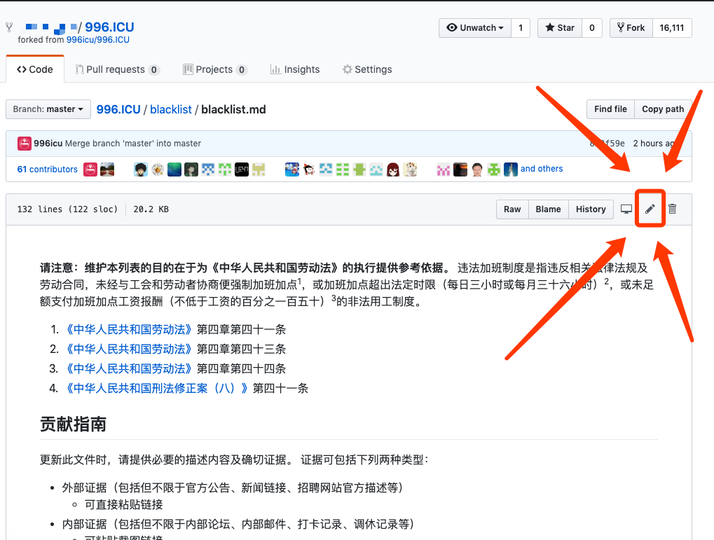
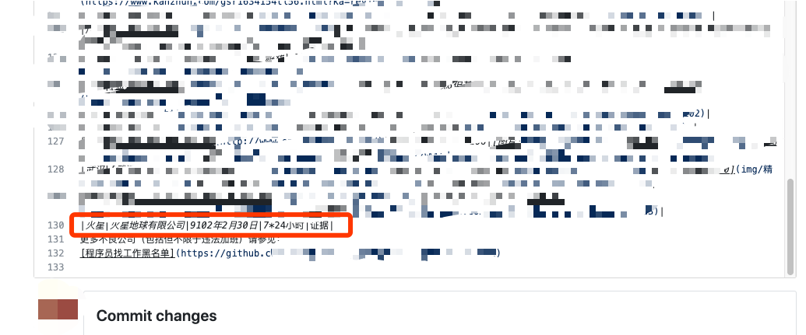
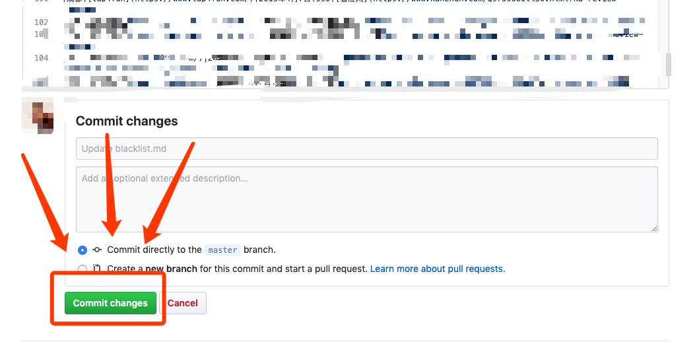
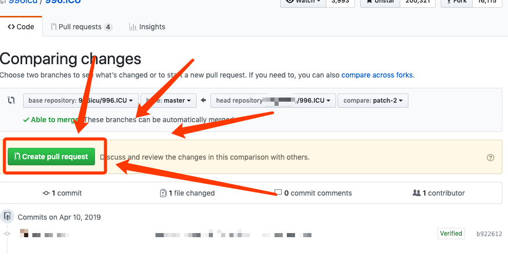

简易教程
-------
- 首先，你需要注册一个github账号，不是太难，除了英语本身外，流程和所需信息比国内绝大多数网站少的多。教程链接：[百度经验](https://jingyan.baidu.com/article/4ae03de3d6f9c53eff9e6bdd.html)
- 然后请在浏览器输入这个地址：https://github.com/996icu/996.ICU
- 找到你想改的文件点击编辑。以希望添加blacklist为例，首先点击blacklist那个文件夹，然后点击blacklist.md，然后点击右侧的铅笔。
- 编辑内容，想写啥写啥。如果你不知道如何符合正确的格式，或者不知道如何添加证据等，可以先简单的写下内容，然后继续。在后续的步骤里会有教你如何寻求帮助。
- 点击绿色按钮（按钮文字不一样不用管，点就完事了） 
- 点绿色按钮。
- 填写你要干嘛，如果你在上传文件、添加链接等遇到困难，可以试着在这写，大家一眼都能看得到。
- 最后点击"create pull request"。然后大家就有机会知道你要干嘛了。

其他教程
-------
https://juejin.im/post/5b5d50bd5188251b3e646c5c  
<small><del>求补充，求修正</del></small>