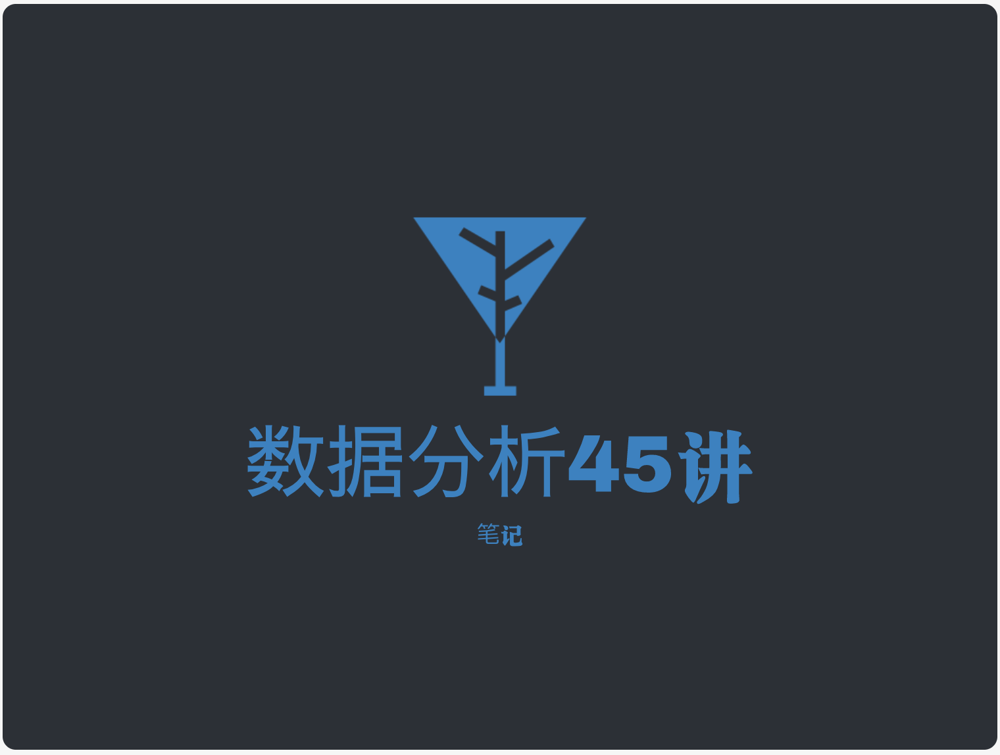
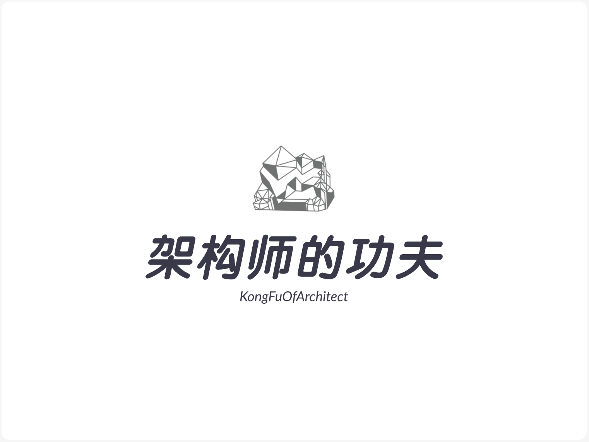

Projects under Anti 996ICU License. Thanks for your support!
===

贡献指南
===
- LOGO尺寸
  - 建议大小 *60 * 60* ``
- 官网链接
  - 如果是GitHub仓库，请按此格式填写`[GitHub](url)`
  - 如果是其他网站，请按此格式填写`[官网名称或项目名称](url)`

[Chansos-Website-Official]:https://chansos.com
[Chansos-Website-GitHub]:https://github.com/ChangedenCZD

| LOGO | 项目|官网|Stars|简介|License|
|:---:|:---|:---|:---|:---|----|
||[Easy Mybatis](https://github.com/onlyGuo/easymybatis) |[GitHub](https://github.com/onlyGuo/easymybatis)||在内存中自动生成Mapper 但不会释放文件到硬盘.| with |
|-|[在线视频字幕（ASS）编辑器](https://ass-editor.js.org)|[ass editor](https://ass-editor.js.org)||在线编辑视频字幕| with |
||HadoopHADeploymentScript|[GitHub](https://github.com/Fa1c0nSec/HadoopHADeploymentScript) / [Official](https://go.fa1c0n.cn/6)||Hadoop 双机集群高可用系统自动化部署脚本||
|-|[tsmon](https://www.npmjs.com/package/tsmon)|[GitHub](https://www.github.com/agentframework/tsmon)||TypeScript版本的nodemon和ts-node集合体，缓存编译结果，支持增量编译，TypeScript开发利器||
|-|[async-retry.ts](https://www.npmjs.com/package/async-retry.ts)|[GitHub](https://www.npmjs.com/package/async-retry.ts)||Retry Pattern 的 TypeScript 实现||
|-|yasio|[GitHub](https://github.com/halx99/yasio)||A cross platform & lightweight socket io service||
|-|WAF|[GitHub](https://github.com/chengdedeng/waf)||Web Application Firewall or API Gateway(应用防火墙/API网关)||
||ID Card|[GitHub](https://github.com/ofcold/identity-card)||身份证号码信息||
|  | [dura](https://github.com/CN-YUANYU/dura)                    | [GitHub](https://github.com/CN-YUANYU/dura)                  |   | 基于 redux、typescript 的前端数据流方案                      |  |
|  | [vue-apis](https://github.com/ChangedenCZD/vue-apis)         | [GitHub](https://github.com/ChangedenCZD) / [Official](https://chansos.com) |  | 集成axios的vue插件                                           |  |
|  | [optimize-vue](https://github.com/ChangedenCZD/optimize-vue) | [GitHub](https://github.com/ChangedenCZD) / [Official](https://chansos.com) |  | 基于 vue-cli 3.0 构建的快速开发框架                          |  |
|  | [optimize-vue-cli](https://github.com/ChangedenCZD/optimize-vue-cli) | [GitHub](https://github.com/ChangedenCZD) / [Official](https://chansos.com) |  | 基于 vue-cli 3.0 构建的快速开发框架的脚手架                  |  |
| - | [thinkphp5-restfulapi](https://github.com/Leslin/thinkphp5-restfulapi) | [GitHub](https://github.com/Leslin)                          |  | 基于 thinkphp5 开发的restful api快速开发框架                 |  |
| - | [HookPHP](https://github.com/letwang/HookPHP)                | [GitHub](https://github.com/letwang/HookPHP)                 |  | 一款基于C扩展搭建支持AI在线编程的PHP框架！                   |  |
| - | [zhihu-crawler](https://github.com/wycm/zhihu-crawler)       | [GitHub](https://github.com/wycm/zhihu-crawler)              |  | 基于Java的高性能、支持免费http代理池、横向扩展、分布式爬虫项目 |  |
|  | [MybatisPlus](https://github.com/baomidou/mybatis-plus)      | [MybatisPlus](https://mybatis.plus/)                         |  | Mybatis 扩展组件                                             |  |
|  | [server](https://github.com/wildfirechat/server)             | [wildfirechat](http://docs.wildfirechat.cn/)                 |  | 野火IM解决方案，server端                                     |  |
|  | [WeChatBlog](https://github.com/NiZerin/WeChatBlog)          | [NiZerin](https://github.com/NiZerin)                        |  | 微信小程序 & 个人博客 & WordPress REST API                   |  |
|  | [Yearning](https://github.com/cookieY/Yearning)              | [cookieY](https://github.com/cookieY)                        |  | Mysql SQL审核平台                                            |  |
|  | [java-multi-thread-programming](https://github.com/loveincode/java-multi-thread-programming) | [GitHub](https://loveincode.github.io/java-multi-thread-programming/) |  | 《Java多线程编程核心技术》源码                               |  |
|  | [notes](https://github.com/loveincode/notes)                 | [GitHub](https://loveincode.github.io/notes/)                |  | 一个Java后端工程师的学习笔记                                 |  |
|  | [Atom.css](https://github.com/isVertical/atom.css)           | [atom.css site](https://isvertical.github.io/atom.css/)      |  | Atom.css 一个提供原子化风格Class的UI库                       |  |
| - | [mina-gulp-cli](https://github.com/milobluebell/mina-gulp-cli) | [GitHub](https://github.com/milobluebell/mina-gulp-cli)      |  | 一个轻量级的小程序开发脚手架，基于gulp                       |  |
| - | [aya-store](https://github.com/milobluebell/aya-store)       | [GitHub](https://github.com/milobluebell/aya-store)          |  | 小程序状态管理模块                                           |  |
| - | [eppdev-jee-pom](https://github.com/eppdev/eppdev-jee-pom)   | [eppdev-jee-pom](https://jee.eppdev.cn)                      |  | 数据驱动的JavaEE代码生成程序                                 |  |
|  | [You-need-to-know-css](https://github.com/l-hammer/You-need-to-know-css) | [You-need-to-know-css](https://lhammer.cn/You-need-to-know-css) |  | 💄CSS tricks for web developers\~                             |  |
|  | [awesome-golang-leetcode](https://github.com/kylesliu/awesome-golang-leetcode) | [Kyle Liu](https://github.com/kylesliu)                      |  | 📠LeetCode of algorithms with golang solution(updating).     |  |
| - | [easy-filter](https://github.com/PsChina/easy-filter)        | [GitHub](https://github.com/PsChina) / [npm](https://www.npmjs.com/package/easy-filter) |  | vue2.x 过滤器插件                                            |  |
| - | [Vueg](https://github.com/jaweii/Vueg----page-transition-plugin) | [GitHub](https://github.com/jaweii/Vueg----page-transition-plugin) |  | Page level transition plugin for vue-router                  |  |
| - | [one](https://github.com/lizhichao/one)                      | [GitHub](https://github.com/lizhichao/one)                   |    | 一个极简的高性能常驻内存php框架                              |  |
|  | [Pipi-Dinosaur](https://github.com/martin-yin/Pipi-Dinosaur) | [GitHub](https://github.com/martin-yin/Pipi-Dinosaur)        |  | 皮皮🦖 微信小程序color-ui的vue版本                            |  |
| - | [WxJava](https://github.com/Wechat-Group/WxJava)             | [GitHub](https://github.com/Wechat-Group/WxJava)             |  | 微信开发 Java SDK                                            |  |
| - | [cyclone](https://github.com/simpleapples/cyclone)           | [GitHub](https://github.com/simpleapples/cyclone)            |  | Cyclone is a go package to spawn, reuse and manage a number of goroutines by a pool. |  |
| - | [NumbCube](https://github.com/KirosHan/NumbCube)             | [GitHub](https://github.com/KirosHan/NumbCube)               |  | NumbCube流媒体直播解决方案                                   |  |
| - | [bootcdn](https://github.com/AJLoveChina/bootcdn)            | [GitHub](https://github.com/AJLoveChina/bootcdn)             |  | :wrench:快速查询一个开源库在bootcdn的URL地址                 |  |
| - | [vue-keyboard](https://github.com/AJLoveChina/vue-keyboard)  | [vue-keyboard](https://ajlovechina.github.io/vue-keyboard/docs/index.html) |  | :musical_keyboard:A real hand tapping keyboard for vuejs.    |  |
|  | [Leetcode-Java](https://github.com/pphdsny/Leetcode-Java)    | [GitHub](https://github.com/pphdsny/Leetcode-Java)           |  | Leetcode java题解，持续更新                                  |  |
| - | [dynamic-add-date](https://github.com/yidasanqian/dynamic-add-date) | [GitHub](https://github.com/yidasanqian/dynamic-add-date)    |  | 一款基于MyBatis框架，可以对插入和更新Sql语句动态地添加日期列和对应值的插件 |  |
| - | [WebSocketDemo](https://github.com/0xZhangKe/WebSocketDemo)  | [GitHub](https://github.com/0xZhangKe/WebSocketDemo)         |  | 用于简化 WebSocket 在 Android 平台使用的封装方法             |  |
| - | [ShiZhong](https://github.com/0xZhangKe/ShiZhong)            | [GitHub](https://github.com/0xZhangKe/ShiZhong)              |  | 一个用于制定各种计划的APP                                    |  |
| - | [BAButton](https://github.com/BAHome/BAButton)               | [GitHub](https://github.com/BAHome/BAButton)                 |  | 一款OC语言的按钮各种文字图片状态的封装                       |  |
| - | [boilerplate-creator](https://github.com/oychao/boilerplate-creator) | [GitHub](https://github.com/oychao/boilerplate-creator)      |  | 一个支持自定义模板源的脚手架构建工具                         |  |
| - | [react-router-alive](https://github.com/oychao/react-router-alive) | [GitHub](https://github.com/oychao/react-router-alive)       |  | react-router版的keep-alive路由组件                           |  |
| - | [SKM](https://github.com/TimothyYe/skm)                      | [GitHub](https://github.com/TimothyYe/skm)                   |    | A simple and powerful SSH Keys Manager.                      |  |
| - | [ajax-js](https://github.com/GerryIsWarrior/ajax)            | [GitHub](https://github.com/GerryIsWarrior/ajax)             |  | 前端ajax解决方案，励志让前端更美好的库                       |  |
| - | [FPN-SemanticSeg](https://github.com/ElephantGit/SemanticSegmentationUsingFPN_PanopticFeaturePyramidNetworks) | [FPN-SemanticSeg](https://github.com/ElephantGit/SemanticSegmentationUsingFPN_PanopticFeaturePyramidNetworks) |  | 一个使用FPN进行语义分割的实现                                |  |
| - | [微信群聊游戏](https://github.com/Whoisurdady/WeChatRoomGame) | [GitHub](https://github.com/Whoisurdady/WeChatRoomGame)      |  | 一个利用微信python api实现的聊天机器人和成语接龙游戏         |  |
| - | [SlideBack](https://github.com/ParfoisMeng/SlideBack)        | [GitHub](https://github.com/ParfoisMeng/SlideBack)           |  | (Android)无需继承的Activity侧滑返回库 类全面屏返回手势效果 仿“即刻”侧滑返回 |  |
|  | [ata](https://github.com/yahtnif/ata)                        | [GitHub](https://github.com/yahtnif/ata)                     |      | axios + auto encode url + ...fetch style requests with `$` prefixed methods, like `axios-module` support string proxy config like `127.0.0.1:9000` |  |
|  | [foke](https://github.com/yahtnif/foke)                      | [GitHub](https://github.com/yahtnif/foke)                    |     | Simple job queues, with dash server.                         |  |
|  | [ixi](https://github.com/yahtnif/ixi)                        | [GitHub](https://github.com/yahtnif/ixi)                     |      | Structure selection parser.                                  |  |
|  | [randelay](https://github.com/yahtnif/randelay)              | [GitHub](https://github.com/yahtnif/randelay)                |  | Delay a promise a specified amount of time                   |  |
|  | [random-mua](https://github.com/yahtnif/random-mua)          | [GitHub](https://github.com/yahtnif/random-mua)              |  | Random Modern User-Agent.                                    |  |
|  | [smarkdown](https://github.com/yahtnif/smarkdown)            | [GitHub](https://github.com/yahtnif/smarkdown)               |  | Markdown parser, simplicity and extensibility.               |  |
|  | [suni](https://github.com/yahtnif/suni)                      | [GitHub](https://github.com/yahtnif/suni)                    |     | Arr, Hash, Is, Obj, Random, Str, Wrandom                     |  |
|  | [Edge Translate](https://github.com/EdgeTranslate/EdgeTranslate) | [GitHub](https://github.com/EdgeTranslate) / [Chrome Web Store](https://chrome.google.com/webstore/detail/bocbaocobfecmglnmeaeppambideimao) / [Firefox Add-ons](https://addons.mozilla.org/firefox/addon/edge_translate) |  | 一款支持多种浏览器的网页翻译插件                             |  |
|  | [AMEGetterMaker](https://github.com/ame017/AMEGetterMaker)   | [GitHub-AMEGetterMaker](https://github.com/ame017/AMEGetterMaker) |  | (Xcode)一个无需resign的Xcode懒加载生成器                     |  |
|  | [AMECategoryMaker](https://github.com/ame017/AMECategoryMaker) | [GitHub-AMECategoryMaker](https://github.com/ame017/AMECategoryMaker) |  | (Xcode)一个无需resign的Xcode category生成器                  |  |
|  | [vscode-syncing](https://github.com/nonoroazoro/vscode-syncing) | [Syncing - Visual Studio Marketplace](https://marketplace.visualstudio.com/items?itemName=nonoroazoro.syncing) |  | Syncing 是一个 VSCode 扩展，它能在多台设备之间同步您的所有 VSCode 配置。 |  |
|  | [Bounce](https://github.com/zhangyu0310/bounce)              | [Bounce](https://zhangyu0310.github.io/bounce/)              |  | A C++11 network library in Linux.                            |  |
| - | [Swoole IDE helper](https://github.com/wudi/swoole-ide-helper) | [GitHub](https://github.com/wudi/swoole-ide-helper)          |  | Auto completion, trigger suggest and view docs for Swoole in editor. |  |
|  | [CSV2Entity](https://github.com/juwikuang/csv2entity)        | [GitHub](https://github.com/juwikuang/csv2entity)            |  | 用CSV生成.net class                                          |  |
|  | [image-cropper](https://github.com/wx-plugin/image-cropper)  | [GitHub](https://github.com/wx-plugin/image-cropper)         |  | 💯一款功能强大的微信小程序图片裁剪插件                        |  |
|  | [cvpm](https://github.com/unarxiv/cvpm)                      | [GitHub](https://github.com/unarxiv/cvpm)                    |     | 计算机视觉的包管理工具                                       |  |
|  | [MusiCoder](https://github.com/Pzoom522/MusiCoder)           | [GitHub](https://github.com/Pzoom522/MusiCoder) / [SourceForge](https://musicoder.sourceforge.io) / [Paper](https://arxiv.org/abs/1810.01248) / [Poster](https://doi.org/10.13140/RG.2.2.35251.89120) |  | :musical_score:基于深度学习的轻量化音乐质感转换系统          |  |
| - | [TensorFlow-2.0-Tutorials](https://github.com/dragen1860/TensorFlow2.0Tutorials) | [GitHub](https://github.com/dragen1860/TensorFlow2.0Tutorials) |  | TensorFlow 2.0实战教程                                       |  |
| - | [CHOLMOD](https://github.com/LyqSpace/Cholmod-Scikit-Sparse-Windows) | [GitHub](https://github.com/LyqSpace/Cholmod-Scikit-Sparse-Windows) |  | CHOLMOD和Scikit-Sparse科学计算工具包的Windows版本            |  |
| - | [Unity 3D ShaderLab Development Practice Introduction, 3rd version](https://github.com/AShine17cm/ShaderLab) | [Unity 3D ShaderLab Development Practice Introduction, 3rd version](https://github.com/AShine17cm/ShaderLab) |  | 《Unity 3D ShaderLab开发实战详解》第三版源码                 |  |
|  | [Fastquery](https://github.com/xixifeng/fastquery)           | [GitHub](https://github.com/xixifeng/fastquery)              |  | Open source DB extreme speed operating tool with an interface-oriented design style(开源DB极速操作工具,采用不得不面向接口的设计风格) |  |
| - | [zoro](https://github.com/FaureWu/zoro)                      | [zoro](https://faurewu.github.io/zoro/)                      |     | zoro是一套基于redux的轻量级前端框架，用于快速接入redux，支持原生小程序wepy, taro, react等 |  |
| - | [ThrustRTC](https://github.com/fynv/ThrustRTC)               | [ThrustRTC](https://github.com/fynv/ThrustRTC)               |   | CUDA tool set for python (and other non-C/C++ languages) that provides similar functionality like Thrust, with NVRTC at its core. |  |
| - | [Privexec](https://github.com/M2Team/Privexec)               | [Privexec](https://github.com/M2Team/Privexec)               |  | Privexec 在 Windows 上使用指定的权限级别启动进程，包括 AppContainer |  |
| - | [Clangbuilder](https://github.com/fstudio/clangbuilder)      | [Clangbuilder](https://github.com/fstudio/clangbuilder)      |  | Windows 系统下的 LLVM/Clang 自动化构建工具                   |  |
| - | [ARPG](https://raw.githubusercontent.com/ChangedenCZD/996.ICU/local/awesomelist/img/icon.chansos.com.png) | [GitHub](https://github.com/xxpniu/version/)                 |  | Unity 框架 支持行为编辑和技能时间轴编辑，用以快速搭建ARPG游戏框架 |  |
| - | [myTranslate](https://github.com/Julyme/myTranslate)         | [GitHub](https://github.com/Julyme/myTranslate)              |  | 一款基于eclipse的插件，用于翻译。                            |  |
|  | [SmartTaskbar](https://github.com/ChanpleCai/SmartTaskbar)   | [GitHub](https://github.com/ChanpleCai/SmartTaskbar)         |  | A Lightweight Windows Taskbar Enhancement Utility            |  |
| - | [Image-Downloader](https://github.com/sczhengyabin/Image-Downloader) | [GitHub](https://github.com/sczhengyabin/Image-Downloader/)  |  | 支持多个搜索引擎的网络图片批量爬虫工具                       |  |
| - | [git-hook-996](https://github.com/jeasonstudio/git-hook-996) | [GitHub](https://github.com/jeasonstudio/git-hook-996)       |  | 禁止在正常工作时间外提交代码                                 |  |
| - | [smart-hooks](https://github.com/Chersquwn/smart-hooks)      | [GitHub](https://github.com/Chersquwn/smart-hooks)           |  | 简单、实用的react-hooks                                      |  |
|  | [Audio Frequency Graph Generator](https://github.com/haoranzhang929/audio-frequency-visual-generators) | [GitHub](https://github.com/haoranzhang929/audio-frequency-visual-generators) |  | 网页端音频频率数据分析工具                                   |  |
|  | [SnowLeopard](https://github.com/alienwow/SnowLeopard)       | [GitHub](https://github.com/alienwow/SnowLeopard)            |  | 实用的 .net core 工具包                                      |  |
| - | [Rako](https://github.com/rabbitooops/rako)                  | [GitHub](https://github.com/rabbitooops/rako)                |  | 声明式的JavaScript状态容器                                   |  |
| - | [react-blog](https://github.com/gershonv/react-blog)         | [GitHub](https://github.com/gershonv/react-blog)             |  | 一个使用 react 16.8 + koa2 + mysql 构建的简约 spa 博客       |  |
| - | [AndroidPicker](https://github.com/gzu-liyujiang/AndroidPicker) | [GitHub](https://github.com/gzu-liyujiang/AndroidPicker)     |  | 安卓选择器类库，包括日期选择器、时间选择器、单项选择器、双项选择器、二三级联动选择器、城市地址选择器、数字选择器、颜色选择器、文件选择器、目录选择器等 |  |
| - | [vue-drag-tree](https://vigilant-curran-d6fec6.netlify.com/#/) | [GitHub](https://github.com/shuiRong/vue-drag-tree)          |  | a Vue's drag and drop tree component（一个可拖拽的树形Vue.js组件） |  |
|  | [cnlgbtdata](https://cnlgbtdata.com)                         | [cnlgbtdata](https://cnlgbtdata.com)                         |                                                              | 国内LGBT相关资料及法律信息收集站                             | \-                           |
| - | [AndroidAnti996Browser](https://github.com/xianfengting/AndroidAnti996Browser) | [GitHub](https://github.com/xianfengting/AndroidAnti996Browser) |  | Android反996浏览器项目,为996.ICU项目而开发,用以解决部分国产浏览器限制或禁止访问996.ICU相关页面的问题.目前该项目已经发布开发版本(在项目主页Release页面下).欢迎大家的支持. |  with  |
| - | [QuickFrontend](https://github.com/sinri/QuickFrontend)      | [GitHub](https://github.com/sinri/QuickFrontend)             |  | A simple frontend framework is designed for quick develop with vue.js 2, iview.ui 3, axios, js-cookie. |  |
| - | [QTL](https://github.com/znone/qtl)                          | [GitHub](https://github.com/znone/qtl)                       |        | A friendly and lightweight C++ database library for MySQL, SQLite and ODBC. |  |
| - | [go-server-js](https://github.com/zengming00/go-server-js)   | [GitHub](https://github.com/zengming00/go-server-js)         |  | javascript web server, js server, 一种新的javascript写服务端程序的方案，没有回调，完全不同于node.js，更像php，或者说是披着js皮的go |  |
| - | [node-gd-bmp](https://github.com/zengming00/node-gd-bmp)     | [GitHub](https://github.com/zengming00/node-gd-bmp)          |  | light and high speed and 100% js implement graphical library, it can running in any platform |  |
|  | [arxiv.repo](https://github.com/Mainvooid/arxiv.repo)        | [GitHub](https://github.com/Mainvooid/arxiv.repo)            |  | arXiv上公开了项目源码的论文合集                              |  |
| - | [996-icu-banner](https://github.com/SamChou19815/996-icu-banner) | [GitHub](https://github.com/SamChou19815/996-icu-banner) / [Demo](https://996-icu-banner.developersam.com/) / [npm](https://www.npmjs.com/package/@dev-sam/996-icu-banner) |  | The banner for your personal website to show support for 996.icu. |  |
|  | [Tetris](https://github.com/deepgrace/tetris)                | [GitHub](https://github.com/deepgrace/tetris)                |  | Tetris in all kinds of Languages                             |  |
|  | [Carrier](https://github.com/deepgrace/carrier)              | [GitHub](https://github.com/deepgrace/carrier)               |  | Modern C++ Network Server FrameWork                          |  |
|  | [Giant](https://github.com/deepgrace/giant)                  | [GitHub](https://github.com/deepgrace/giant)                 |  | Algorithms and Data Structures in Modern C++                 |  |
|  | [Monster](https://github.com/deepgrace/monster)              | [GitHub](https://github.com/deepgrace/monster)               |  | Advanced Template MetaProgramming in Modern C++              |  |
|  | [Stored Programs](https://github.com/deepgrace/stored.programs) | [GitHub](https://github.com/deepgrace/stored.programs)       |  | Stored Programs (Function, View, Trigger and Stored Procedure) in SQL |  |
| - | [CSI Enhancement Tools](https://github.com/shuspieler/Athero-CSI-tool-Python-RemoteReceive-Liveview-AmplitudeScaled) | [GitHub](https://github.com/shuspieler/Athero-CSI-tool-Python-RemoteReceive-Liveview-AmplitudeScaled) |  | CSI (Channel State Information) Enhancement Tools            |  |
| - | [Thymeleaf-Reference-Guide](https://github.com/jack80342/Thymeleaf-Reference-Guide) | [GitHub](https://github.com/jack80342/Thymeleaf-Reference-Guide) |  | Thymeleaf 3.0 中文翻译 -《Thymeleaf参考指南》                |  |
| - | [Spring-Boot-Reference-Guide](https://github.com/jack80342/Spring-Boot-Reference-Guide) | [GitHub](https://github.com/jack80342/Spring-Boot-Reference-Guide) |  | Spring Boot Reference Guide 2.0 中文翻译 -《Spring Boot参考指南》 |  |
|  | [Hikyuu Quant Framework](https://hikyuu.org)                 | [GitHub](https://github.com/fasiondog/hikyuu)                |  | 基于C++/Python的高性能开源量化交易研究框架                   |  |
| - | [SimpleKernel](https://github.com/MRNIU/SimpleKernel)        | [GitHub](https://github.com/MRNIU/SimpleKernel)              |  | 一个用于学习 kernel 的简单入门资源                           |  |
| - | [no-cron](https://github.com/jerrywdlee/no-cron)             | [GitHub](https://github.com/jerrywdlee/no-cron) / [知乎](https://zhuanlan.zhihu.com/p/61612658) |  | A fack cron for docker users / 用在某些corn抽风了的container上的仿制cron |  |
|  | [CloudOpenDevOps](http://www.opendevops.cn/)                 | [GitHub](https://github.com/opendevops-cn/opendevops) / [Demo](https://demo.opendevops.cn/login) |  | CODO是一款为用户提供企业多混合云、自动化运维、完全开源的云管理平台。 |  |
| - | [PUSH TO KINDLE!](https://github.com/Aneureka/push-to-kindle) | [GitHub](https://github.com/Aneureka/push-to-kindle)         |  | 一个简洁优雅的 Kindle 文档推送工具                           |  |
| - | [android-chat](https://github.com/wildfirechat/android-chat) | [GitHub](https://github.com/wildfirechat/android-chat)       |  | 一款全开源的Android IM 应用                                  |  |
| - | [ios-chat](https://github.com/wildfirechat/ios-chat)         | [GitHub](https://github.com/wildfirechat/ios-chat)           |  | 一款全开源的iOS即时通讯APP                                   |  |
|  | [谷粒-Chrome插件英雄榜](https://github.com/zhaoolee/ChromeAppHeroes) | [GitHub](https://github.com/zhaoolee/ChromeAppHeroes)        |  | 🌈谷粒-Chrome插件英雄榜, 为优秀的Chrome插件写一本中文说明书, 让Chrome插件英雄们造福人类\~ |  |
| - | [winger](https://github.com/huanStephen/winger)              | [GitHub](https://github.com/huanStephen/winger)              |  | 基于http协议的数据代理工具                                   |  |
| - | [tkJSPinyin](https://github.com/Tedko/tkJSPinyin)            | [GitHub](https://github.com/Tedko/tkJSPinyin)                |  | Get Chinese pinyin from Chinese. Based on JSPinyin. Ported to ES6, no need for mootool, etc. |  |
|  | [cmdb](https://gitee.com/py2010/cmdb)                        | [cmdb](https://github.com/py2010/cmdb)                       |                                                              | django, webssh, websftp, docker 容器管理, web =\> xshell (从CMDB网页直接跳转到Xshell终端) | \- |
|  | [SecurityPaper](https://github.com/SecurityPaper/SecurityPaper-web/) | [www.securitypaper.org](https://www.securitypaper.org)       |  | SecurityPaper 致力于中国互联网公司安全建设指导意见白皮书，所有文档都来自中国互联网一线安全工程师编写整理 |  |
|  | [DataAnalysisInAction](https://github.com/xiaomiwujiecao/DataAnalysisInAction) | [GitHub](https://github.com/xiaomiwujiecao/DataAnalysisInAction) |  | 极客时间数据分析实战45讲的详细笔记(包含markdown、图片、思维导图、代码 、数据) ！ |  |
| - | [996icu-slack-recorder](https://github.com/simon300000/996icu-slack-recorder) | [GitHub](https://github.com/simon300000/996icu-slack-recorder) |  | 996icu Slack会议记录Bot                                      |  |
| - | [JApiDocs](https://github.com/YeDaxia/JApiDocs)              | [GitHub](https://github.com/YeDaxia/JApiDocs)                |  | Api Docs Generator Tools For Java Web Developer. (Java 高效 API 接口文档生成工具) |  |
| - | [UAFormat.js](https://github.com/jeeinn/ua-format-js)        | [GitHub](https://github.com/jeeinn/ua-format-js)             |  | 一个userAgent解析器UAFormat.js(参考UAParser.js)              |  |
| - | [Shadowsocks-Check](https://github.com/JamCh01/shadowsocks_check) | [GitHub](https://github.com/JamCh01/shadowsocks_check)       |  | You can check your SS server status by this script. And it will be the most graceful way. |  |
|  | [react-keep-alive](https://github.com/StructureBuilder/react-keep-alive) | [GitHub](https://github.com/StructureBuilder/react-keep-alive) |  | 一个保持组件状态并避免重复重渲染的组件                       |  |
| - | [react-inputs-validation](https://github.com/edwardfhsiao/react-inputs-validation) | [GitHub](https://github.com/edwardfhsiao/react-inputs-validation) / [Npm](https://www.npmjs.com/package/react-inputs-validation) |  | React inputs validation components.                          |  |
|  | [Rime极点五笔码表](https://github.com/KyleBing/rime-wubi86-jidan) | [GitHub](https://github.com/KyleBing/rime-wubi86-jidan)      |  | Mac Rime (鼠须管) 五笔极点码表，配置方案                     |  |
|  | [MacbookPro Touchbar 个性化](https://github.com/KyleBing/TouchbarBBT) | [GitHub](https://github.com/KyleBing/TouchbarBBT)            |  | 结合 BetterTouchTool 实现个性化 Macbook Pro Touch bar        |  |
|  | [imageCrop](https://github.com/mrme2014/imageCrop/tree/add-license-1) | [GitHub](https://github.com/mrme2014/imageCrop/tree/add-license-1) |  | 基于android6.0系统源码的图片裁剪库                           |  |
| - | [996.BROWSER](https://github.com/996browser/996.BROWSER)     | [GitHub](https://github.com/996browser/996.BROWSER)          |  | 屏蔽996.icu的浏览器列表                                      |  |
| - | [BMChineseSort](https://github.com/Baymax0/BMChineseSort)    | [GitHub](https://github.com/Baymax0/BMChineseSort)           |  | iOS端的基于某个中文属性的模型数组排序                        |  |
|  | [nginx-log-rotation](https://github.com/chenrulongmaster/nginx-log-rotation) | [GitHub](https://github.com/chenrulongmaster/nginx-log-rotation) |  | Nginx日志滚动                                                |  |
|  | [producer-consumer-problem](https://github.com/chenrulongmaster/producer-consumer-problem) | [GitHub](https://github.com/chenrulongmaster/producer-consumer-problem) |  | Java 多线程生产者消费者问题                                  |  |
|  | [996.ICU.APP](https://github.com/996icuapp/996.icu.app) | [GitHub](https://github.com/996icuapp/996.icu.app) |  | 996/955公司榜单、讨论区、加班工资计算器                                  |  |
|  | [SSList 小型 GFW list](https://github.com/KyleBing/sslist) | [GitHub](https://github.com/KyleBing/sslist)            |  | 小型翻墙列表 GFW list，优化速度       |  |
| - | [DBuilder](https://github.com/lvyahui8/dbuilder) | [GitHub](https://github.com/lvyahui8/dbuilder) |  |  WEB应用CRUD代码生成器，主要用来生成后台管理数据库的代码                                  |  |
| - | [360yunpan](https://github.com/logbird/360yunpan/) | [GitHub](https://github.com/logbird/360yunpan/) | - |  360YunPan Command-line tools, support: Linux Mac Windows| - |
|  | [开源矿工](https://github.com/ntminer/ntminer) | [GitHub](https://github.com/ntminer/ntminer) |  | 显卡一键挖矿软件，一键开挖各种显卡币 |  |
| - | [AetherUpload-Laravel](https://github.com/peinhu/AetherUpload-Laravel) | [GitHub](https://github.com/peinhu/AetherUpload-Laravel) |  |  上传大文件的Laravel扩展 |  |
| - | [Bootstrap-waterfall](https://github.com/Mystist/bootstrap-waterfall) | [Bootstrap-waterfall](https://mystist.github.io/bootstrap-waterfall/) |  | Waterfall the world beauty. |  |
| - | [idetool](https://github.com/coaxhappy/idetool) | [idetool](https://github.com/coaxhappy/idetool) |  | 一键清理VS2015/2017最近打开文件/项目/任务栏跳转列表. |  |
| - | [SweetAlertDialog](https://github.com/Cazaea/SweetAlertDialog) | [GitHub](https://github.com/Cazaea/SweetAlertDialog) |  | Android's custom dialog. |  |
| - | [验证码识别](https://github.com/kerlomz/captcha_trainer) | [GitHub](https://github.com/kerlomz/) |  | 基于TensorFlow的验证码识别框架 - 集训练、识别、API部署、本地调用于一体的框架套件. |  |
|  | [标题日记](https://github.com/KyleBing/diary) | [Diary](https://kylebing.cn/diary)            |  | Web app: 用一句话记录你最珍贵的时刻        |  |
|  | [auto-layout](https://github.com/0123cf/auto-layout) | [GitHub](https://github.com/0123cf/auto-layout)            |  | auto-layout 可视化布局、自动化css布局 ||
|  | [qing-yu](https://github.com/loliconer/qing-yu) | [GitHub](https://github.com/loliconer/qing-yu) |  | 轻语！供团队使用的共享文档管理平台。 |  |
||[Nginx GUI](https://github.com/onlyGuo/nginx-gui) |[GitHub](https://github.com/onlyGuo/nginx-gui)||Nginx 的跨平台GUI 管理工具||
||[Caonima.io](https://caonima.io)|[GitHub](https://github.com/danielsz/system)||Clojure and Shadowsocks powered VPN solution||
||[RxTool](https://github.com/vondear/RxTool) |[GitHub](https://github.com/vondear/RxTool)||Android开发人员的工具类集合||
|  | [pyjieba](https://github.com/chenrulongmaster/pyjieba) | [GitHub](https://github.com/chenrulongmaster/pyjieba) |  | Python 封装C++版本的jieba分词器                                  |  |
|  | [KongFuOfArchitect](https://github.com/xiaomiwujiecao/KongFuOfArchitect) | [GitHub](https://github.com/xiaomiwujiecao/KongFuOfArchitect) |  | 架构师的功夫（包含思想指引、学习资源汇总、范式编程、高效成长、必备算法、等等，为想成为架构师的人铺路） ！ |  |
|-|[go worker pool](https://github.com/sinomoe/go_worker_pool)|[GitHub](https://github.com/sinomoe/go_worker_pool)||goroutine并发控制、调度工具||
||LiveCollectionPlatform|[GitHub](https://github.com/StarSky1/LiveCollectionPlatform)||用Java编写的一个直播汇总平台网站||
||[ResourceManager](https://github.com/ChongqingWangYu/ResourceManager)|[GitHub](https://github.com/ChongqingWangYu/ResourceManager)||Windows资源小管家||
| - | [pool](https://github.com/flyaways/pool) | [GitHub](https://github.com/flyaways/pool) |  |golang通用连接池，支持：GRPC,RPC,TCP|  |
|-|[grpc man](https://www.npmjs.com/package/grpc-man)|[GitHub](https://github.com/Jeff-Tian/grpc-man) / [Official](https://www.npmjs.com/package/grpc-man)||一个 gRPC 客户端，可以灵活地调用 gRPC 服务。名字灵感来源于 `post-man`。||
|  | [Emerald](https://github.com/Red-Error404/Emerald) | [GitHub](https://github.com/Red-Error404/Emerald) |  | 面向游戏开发的轻量级绘图框架 |  |
| - | [pam-mfa](https://github.com/bianyifan/pam-mfa) | [GitHub](https://github.com/bianyifan/pam-mfa) |  | 用于两步验证的 PAM 模块 |  |
|| [Leava](https://github.com/Joey66666/Leava) | [GitHub](https://github.com/Joey66666/Leava) |  | 在线请假管理微信小程序 |  |
| - | [r4v3zn-script](https://github.com/0nise/scripts) | [GitHub](https://github.com/0nise/scripts) |  | 信息安全工具 | |
|  | [vs-shell-format](https://github.com/foxundermoon/vs-shell-format) | [GitHub](https://github.com/foxundermoon/vs-shell-format) ||the vscode shell、dockerfile format extension| |
|-|[VRASLAND](https://github.com/JuerGenie/vrasland)|[GitHub](https://github.com/JuerGenie/vrasland)||一个用于快速搭建简易API原型的可拓展服务器框架||
|-|[GConfig](https://github.com/xianfengting/GConfig)|[GitHub](https://github.com/xianfengting/GConfig)||提供一个类似 Linux 内核 Kconfig 的项目配置 GUI 界面。| with |
||[lambdaroyal-memory](https://github.com/gixxi/lambdaroyal-memory)|[GitHub](https://github.com/gixxi/lambdaroyal-memory)||STM-based in-memory database storing persistent data structures||
||[WebCell](https://web-cell.dev/)|[GitHub](https://github.com/EasyWebApp/WebCell)|| 轻量级 Web Components 标准应用框架 | with |
|  | [mSQL](https://github.com/m-sql/msql) | [GitHub](https://github.com/m-sql/msql) || 一个对SQL美化和自动化改写 及 EXPLAIN 深度解析的工具||
|  | [mPSR](https://github.com/m-sql/mpsr) | [GitHub](https://github.com/m-sql/mpsr)|| PSR 美化  及  PHP Hacker小工具||
